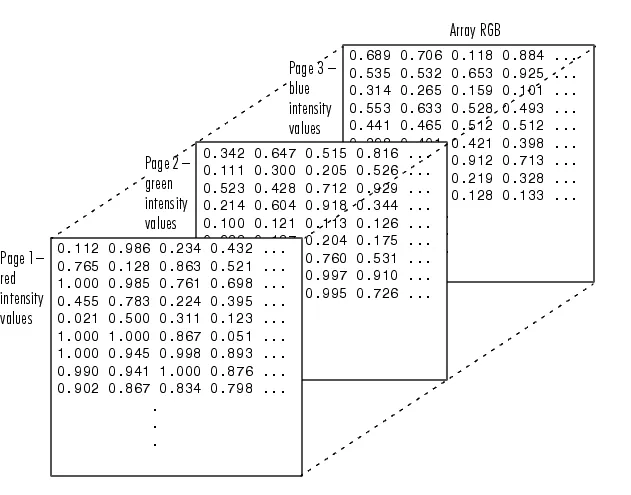
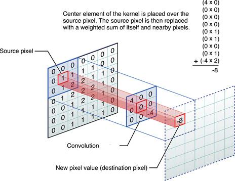
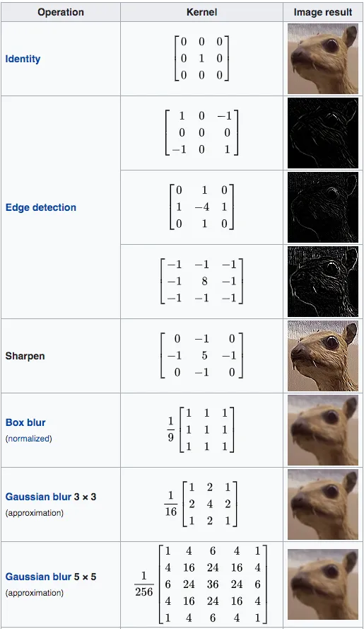
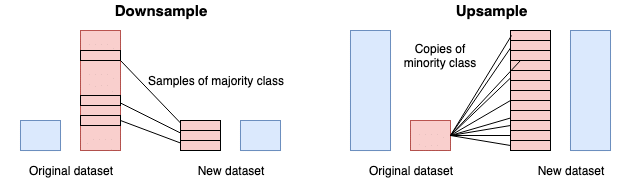

# 2D Convolution

In the Day10 we discussed about multi-dimensional layers, so in this Day11 we will discuss about 2D convolution which is a type of convolutional layer. 

Convolutional layers generally used in image processing or signal processing. So, lets start with the images. This is how image data is stored:

This is the scheme of the convolutional layers:

We have a kernel that is a 3x3 matrix. The kernel is used to extract features from the image. Different kernels used for different operations in images like blurring, edge detection etc.

Then we'll apply the kernel on the image. We'll doing those mathematical operations sequentially to get the desired output:

- The kernel is placed over each pixel of the image (or signal) one by one.
- The result is the sum of the multiplication of the kernel and the image.

  

- The result is stored in the output image
  
  

But there is a problem, feature map or output gets smaller and smaller as we move from the input image to the output image. So, it is called downsampling.

But how to solve this? This involves a combination of techniques:

**Padding**: 

**Strided Convolution**:

**Pooling Layers**: 