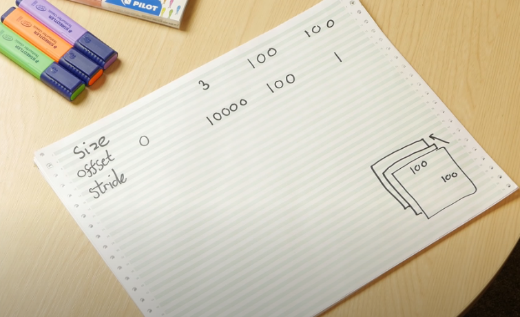
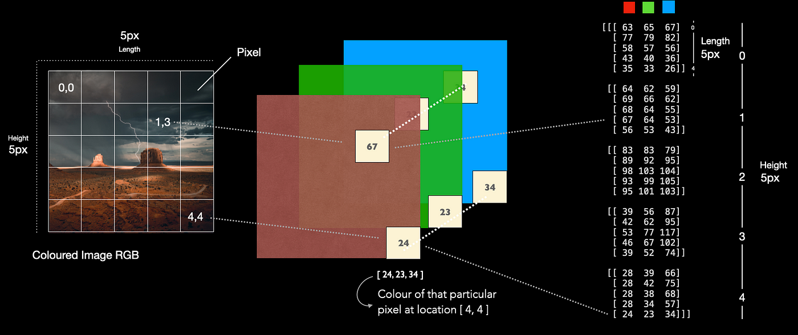
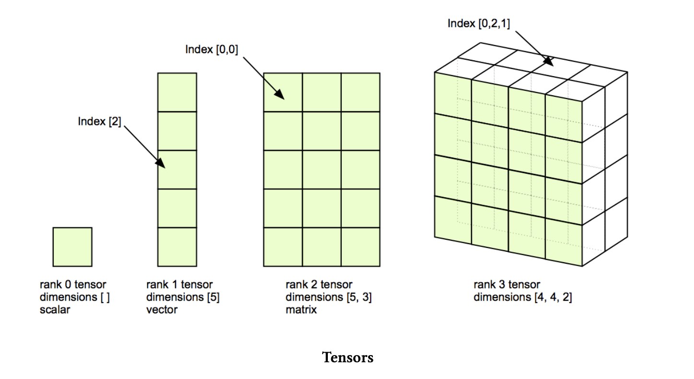
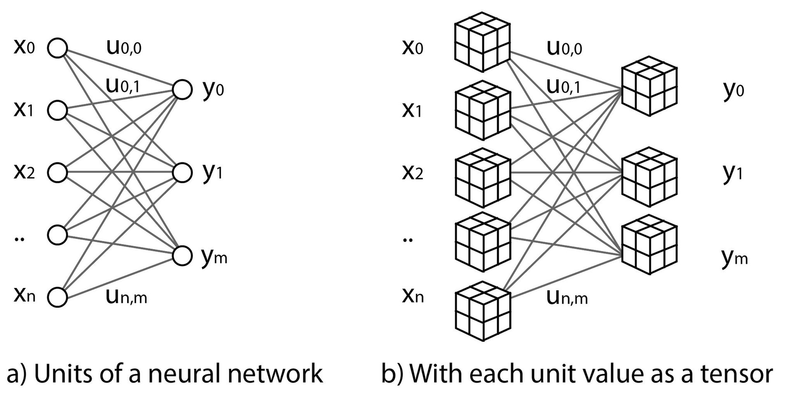

# What does Multi-Dimensional Data or Tensor mean?

Actually this representation is the summary of the concept. We can think the images as Multi-dimensional data types. We have columns, rows and RGB dimensions (which makes size 3), stripe means the steps we go to get to other dimensions. This is an example to understand how images stored: 

Tensors are simply mathematical objects that can be used to describe physical properties, just like scalars and vectors.

In ML data may be organized in a multidimensional array (M-way array) that is informally referred to as a "data tensor"

 Observations, such as images, movies, volumes, sounds, and relationships among words and concepts, stored in an M-way array ("data tensor") may be analyzed either by artificial neural networks or tensor methods.

 
