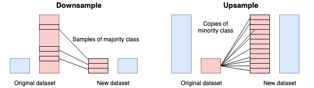
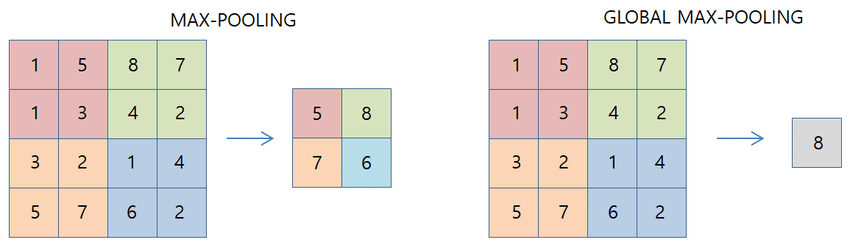

# 2D Convolution

In the Day10 we discussed about multi-dimensional layers, so in this Day11 we will discuss about 2D convolution which is a type of convolutional layer. 

Convolutional layers generally used in image processing or signal processing. So, lets start with the images. This is how image data is stored:

This is the scheme of the convolutional layers:

We have a kernel that is a 3x3 matrix. The kernel is used to extract features from the image. Different kernels used for different operations in images like blurring, edge detection etc.

Then we'll apply the kernel on the image. We'll doing those mathematical operations sequentially to get the desired output:

- The kernel is placed over each pixel of the image (or signal) one by one.
- The result is the sum of the multiplication of the kernel and the image.

  

- The result is stored in the output image
  
  

But there is a problem, feature map or output gets smaller and smaller as we move from the input image to the output image. So, it is called downsampling.

But how to solve this? Setting the size of the output image to the same size as the input or the wanted size involves a combination of techniques:

**Padding**: In summary, padding in CNNs is the technique of adding extra pixels around the input image or feature map to maintain spatial dimensions during the convolution operation. There are two types of padding: valid padding and same padding.  

- **Valid padding** gives you a smaller output size because the filter doesn't extend beyond the image borders.

- **Same padding** gives you the same output size as the input by adding zeros around the image borders to allow the filter to reach the edges.
   

 

**Strided Convolution**: In a standard convolution operation, the kernel moves one pixel at a time (i.e., with a stride of 1). However, with strided convolution, the kernel can move more than one pixel at a time. 

Strided convolution introduces a stride variable that controls the step of the folder as it moves over the input. So, for example, when the stride is equal to 2, the filter skips one pixel every time it slides over the input sample, resulting in a smaller output feature map.

 

**Pooling Layers**:  In a convolutional neural network, pooling layers are applied after the convolutional layer. The main purpose of pooling is to reduce the size of feature maps, which in turn makes computation faster because the number of training parameters is reduced.

There are different types of pooling layers: max pooling, average pooling, global pooling and min pooling:

- **Average Pooling:** The summary of the features in a region are represented by the average value of that region.
 

- **Max Pooling:** The summary of the features in a region are represented by the maximum value in that region.
  

- **Min Pooling:**The summary of the features in a region are represented by the minimum value in that region.
  

- **Global Pooling:** It does the same pooling methods but reduces the size of the feature maps to 1x1.
  
  
