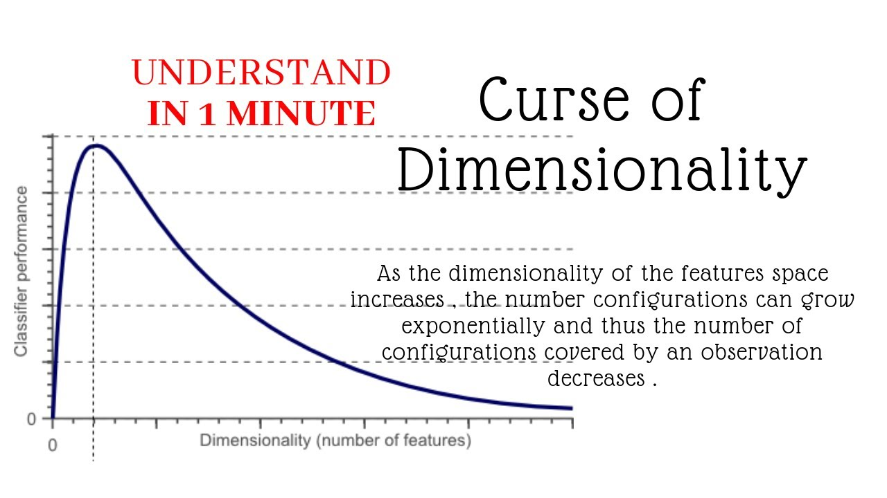

# Curse of Dimensionality 
&nbsp;  The Curse of Dimensionality is a phenomenon that occurs when the complexity and size of the data increases along with the number of features or dimensions. It refers to the difficulties that arise when analyzing and modeling high-dimensional data, as the amount of data required to fill the space grows exponentially with the number of dimensions.
   
&nbsp; In other words, as the number of features or dimensions in a dataset increases, the amount of data required to accurately represent the data increases exponentially. This makes it difficult to analyze and draw meaningful insights from the data, as the data becomes too sparse and the relationships between the features become more difficult to discern.   

It's like: it’s easy to catch a caterpillar moving in a tube(1 dimension). It’s harder to catch a dog if it were running around on the plane (two dimensions). It’s much harder to hunt birds, which now have an extra dimension they can move in. If we pretend that ghosts are higher-dimensional beings, those are even more difficult to catch.   

 

 

**Also when we worked with highly dimensional data it can cause overfitting.** High-dimensional data can lead to overfitting because the more dimensions a dataset has, the more complex its structure becomes, and the more opportunities there are for models to find spurious patterns or noise that may not generalize well to new, unseen data.

 

There are some approaches to prevent this, like 
**dimension reduction what we make something similar while categorizing data** : 
Dimensionality reduction, or dimension reduction, is the transformation of data from a high-dimensional space into a low-dimensional space so that the low-dimensional representation retains some meaningful properties of the original data, ideally close to its intrinsic dimension.