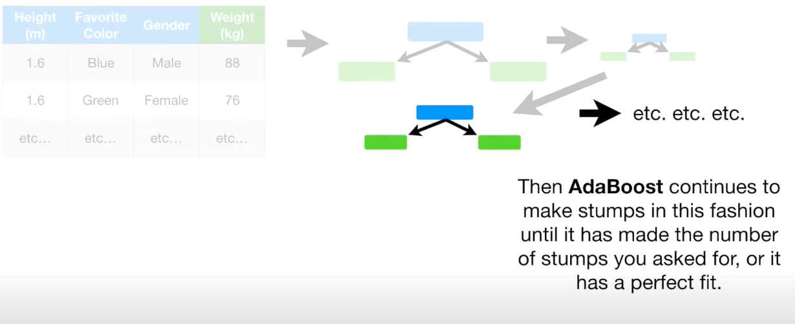
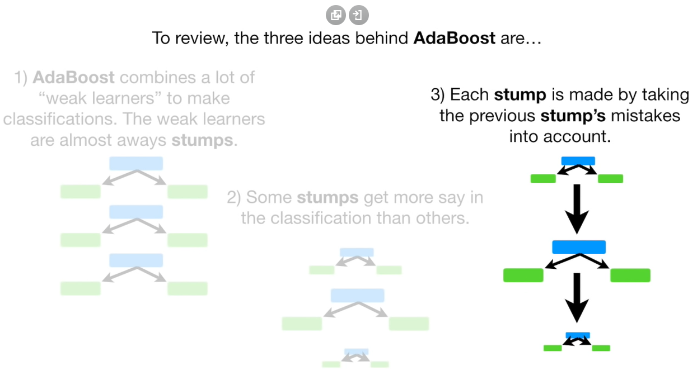
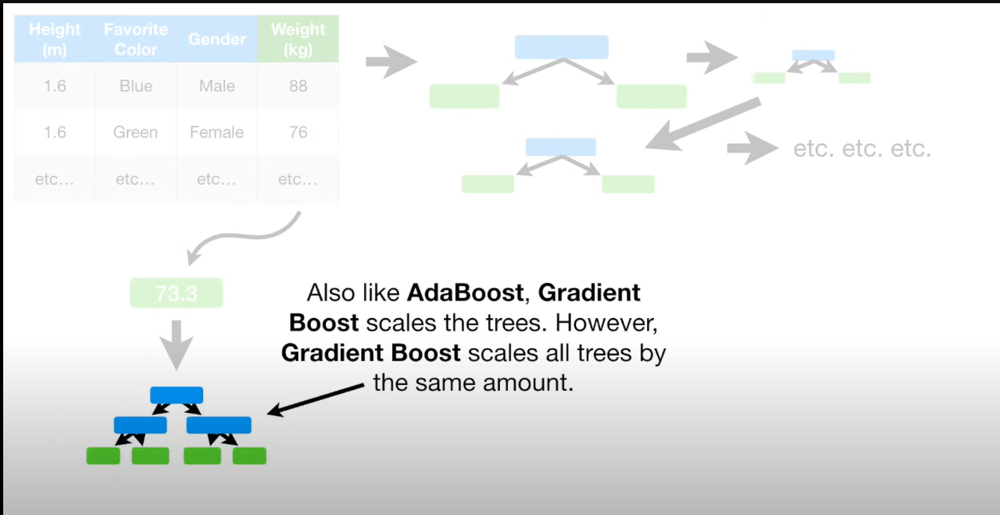

# Boosting 
In machine learning, boosting is a method of converting weak learners into strong learners. In boosting, each new tree is a fit on a modified version of the original data set.  

The **AdaBoost Algorithm (Adaptive Boost)** begins by training a decision tree in which each observation is assigned an equal weight. After evaluating the first tree, we increase the weights of those observations that are difficult to classify and lower the weights for those that are easy to classify. The second tree is therefore grown on this weighted data. Here, the idea is to improve upon the predictions of the first tree. Our new model is therefore Tree 1 + Tree 2. We then compute the classification error from this new 2-tree ensemble model and grow a third tree to predict the revised residuals. We repeat this process for a specified number of iterations. Subsequent trees help us to classify observations that are not well classified by the previous trees. Predictions of the final ensemble model is therefore the weighted sum of the predictions made by the previous tree models.   

 
 

Gradient boosting is a method that goes through cycles to iteratively add models into an ensemble.

It begins by initializing the ensemble with a single model, whose predictions can be pretty naive. (Even if its predictions are wildly inaccurate, subsequent additions to the ensemble will address those errors.)   

  

**NOTE:** 
Weights determine how important each input feature is in making a prediction, bias helps the model to fit the training data more accurately, and variance measures how much a model's predictions vary for different training sets.